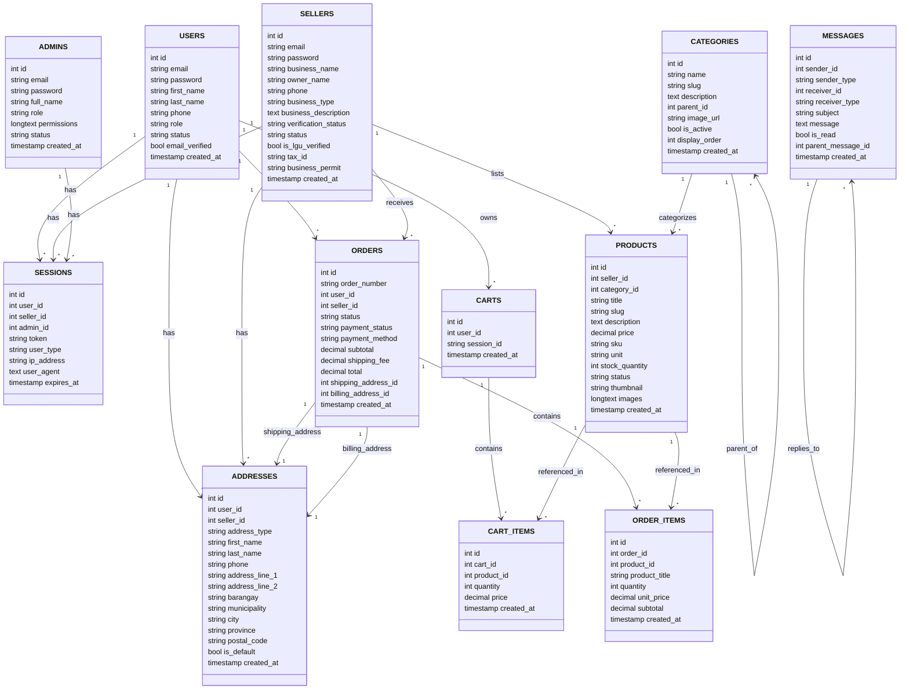

# S2EH Backend ERD (Mermaid)

This file contains an ERD for the `s2eh_db` database in Mermaid `erDiagram` format. Save it and open with a Mermaid preview extension in VS Code or paste into the Mermaid Live Editor (https://mermaid.live/) to render.

Notes:
- PK = primary key; FK = foreign key.
- Some tables (e.g., `sessions`, `addresses`) have nullable foreign keys for multiple user types; the diagram shows relationships for clarity but runtime logic uses `user_type` to determine which FK is active.
- `messages` uses polymorphic sender/receiver (`sender_type`, `receiver_type`) — modeled in schema as fields rather than strict FKs.

How to render:
- In VS Code install the "Markdown Preview Mermaid Support" or the official "Mermaid Markdown Syntax Highlighting" extension, then open `ERD.md` and preview the Mermaid block.
- Or paste the Mermaid block into https://mermaid.live/ to generate PNG/SVG.

If you'd like, I can also:
- Produce a PlantUML `.puml` file.
- Export a PNG (requires a mermaid CLI or using the Mermaid Live Editor to export).
- Simplify the diagram to only core entities for a quick printable ERD.
